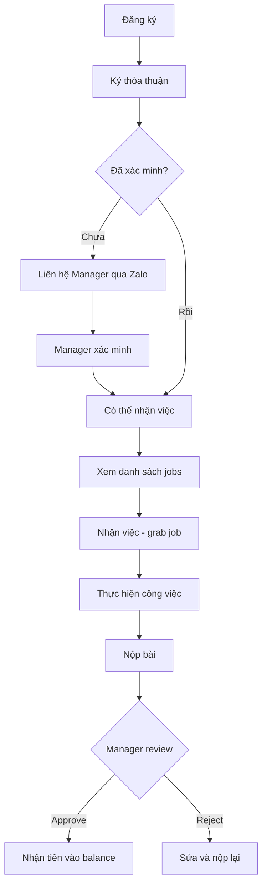
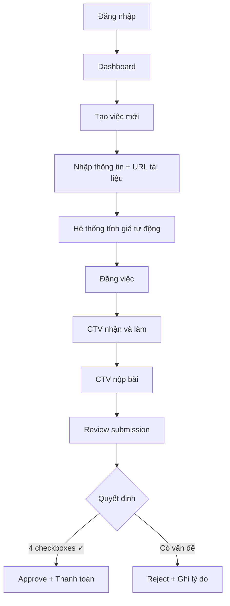

# Sáng Tạo Phái Sinh - Project Manifest

> Platform quản lý công việc localization nội dung AI từ tiếng Trung sang tiếng Việt

---

## 1. Tổng quan Dự án (Project Overview)

### 1.1 Mục tiêu
Xây dựng nền tảng "gig economy" kết nối:
- **Manager**: Đăng công việc localization
- **CTV**: Nhận và thực hiện công việc
- **Admin**: Quản trị hệ thống

### 1.2 Tech Stack

| Layer | Technology |
|-------|------------|
| Frontend | Next.js 15, TypeScript, Tailwind CSS |
| Backend | Supabase (PostgreSQL, Auth, Realtime) |
| Deployment | Vercel + Supabase Cloud |

### 1.3 Cấu trúc thư mục

```
sangtaophaisinh/
├── frontend/src/
│   ├── app/                    # Pages
│   │   ├── (auth)/             # Login, Register, Agreement
│   │   └── (dashboard)/        # Jobs, Manager, Admin, Profile
│   ├── components/             # UI Components
│   ├── lib/                    # Utilities, Supabase clients
│   └── types/                  # TypeScript definitions
├── supabase/migrations/        # SQL migrations
├── DEPLOYMENT.md               # Hướng dẫn deploy
└── README.md                   # File này
```

---

## 2. Luồng Logic & Tính năng (Core Logic & Features)

### 2.1 Luồng CTV (Cộng tác viên)



### 2.2 Luồng Manager (Quản lý)



### 2.3 Hệ thống Pricing

```
Giá = (Số từ × 50đ × Hệ số) + (Phút video × 5,000đ × Hệ số) + Bonus

Hệ số độ phức tạp:
- Easy: 1.0x
- Medium: 1.2x
- Hard: 1.5x
- Expert: 2.0x

Bonus quay lại màn hình: +20%
```

### 2.4 Hệ thống Rank & Credit Score

| Rank | Credit tối thiểu | Jobs đồng thời |
|------|------------------|----------------|
| Newbie | 0 | 1 |
| Regular | 60 | 2 |
| Trusted | 80 | 3 |
| Expert | 95 | 5 |

**Thay đổi điểm:**
- Hoàn thành đúng hạn: +5
- Timeout: -10
- Trả việc: -2

### 2.5 Safety Checkboxes (Bắt buộc khi approve)

1. ✅ An toàn chính trị
2. ✅ Bản đồ đúng (Việt Nam)
3. ✅ Là tác phẩm phái sinh
4. ✅ Không vi phạm bản quyền

### 2.6 Xác minh CTV (V2.0)

- CTV mới cần liên hệ Manager qua Zalo
- Manager vào `/manager/verify` để xác minh
- CTV chưa xác minh không thể nhận việc

---

## 3. Thư viện Prompt (Prompt Engineering Vault)

### 3.1 Tạo Job (Manager)

**Input fields:**
- `title`: Tiêu đề công việc
- `source_url`: URL tài liệu gốc
- `word_count`: Số từ cần dịch
- `video_duration_minutes`: Thời lượng video
- `complexity`: easy | medium | hard | expert
- `is_re_record_required`: Có cần quay lại không
- `ai_tools_used`: ChatGPT, Claude, Midjourney, etc.
- `notes`: Ghi chú cho CTV

### 3.2 Submit Job (CTV)

**Required:**
- `video_url`: Link video đã làm
- `confirm_derivative`: Xác nhận tác phẩm phái sinh
- `confirm_no_copyright`: Xác nhận không vi phạm bản quyền

**Optional:**
- `drive_link`: Link Google Drive
- `notes`: Ghi chú

### 3.3 Review Job (Manager)

**Safety checks (tất cả bắt buộc):**
- `is_political_safe`: boolean
- `is_map_safe`: boolean
- `is_derivative_work`: boolean
- `no_copyright_violation`: boolean

**Decision:**
- `action`: approve | reject
- `rejection_reason`: String (nếu reject)

---

## 4. Quy ước Kỹ thuật (Technical Conventions)

### 4.1 Database Tables

| Table | Mô tả |
|-------|-------|
| `profiles` | Thông tin user (extends auth.users) |
| `jobs` | Công việc |
| `submissions` | Bài nộp của CTV |
| `rank_limits` | Giới hạn theo rank |
| `pricing_config` | Cấu hình giá |

### 4.2 Job Status Flow

```
available → locked → submitted → approved/rejected
                 ↓
           (timeout) → available
```

### 4.3 RPC Functions

| Function | Mục đích |
|----------|----------|
| `lock_job(p_job_id)` | CTV grab job, set deadline |
| `release_job(p_job_id)` | CTV trả job, trừ điểm |
| `verify_ctv(p_ctv_id, p_notes)` | Manager xác minh CTV |

### 4.4 File Naming

- Pages: `page.tsx`
- Components: `kebab-case.tsx`
- Types: `camelCase` in `database.ts`
- SQL: `NNN_description.sql`

### 4.5 Environment Variables

```env
NEXT_PUBLIC_SUPABASE_URL=https://xxx.supabase.co
NEXT_PUBLIC_SUPABASE_ANON_KEY=eyJ...
```

---

## 5. Nhật ký nâng cấp (Roadmap & Changelog)

### Version 1.0 (2024-12-31) ✅

**Core Features:**
- [x] Authentication + Agreement flow
- [x] CTV: Xem jobs, grab, submit, release
- [x] Manager: Tạo job, review, approve/reject
- [x] Admin: Dashboard, users, config
- [x] Pricing tự động
- [x] Rank system với credit score
- [x] Safety checkboxes
- [x] Countdown timer

### Version 2.0 (In Progress) 🔄

**New Features:**
- [x] CTV Profile với SĐT, Zalo
- [x] Xác minh CTV bởi Manager
- [x] Job details trong MyJobCard
- [ ] Notification qua email/Zalo

**Pending:**
- [ ] Thanh toán tự động (bank/momo)
- [ ] CTV wallet & rút tiền
- [ ] Analytics dashboard nâng cao
- [ ] Mobile responsive cải thiện

### Future (V3.0+)

- Multi-language support
- API public cho tích hợp
- AI-assisted translation review
- Marketplace mở rộng

---

## Quick Links

| Trang | URL | Role |
|-------|-----|------|
| Đăng nhập | `/login` | All |
| Đăng ký | `/register` | All |
| Việc làm | `/jobs` | CTV |
| Việc của tôi | `/jobs/my-jobs` | CTV |
| Hồ sơ | `/profile` | CTV |
| Manager Dashboard | `/manager` | Manager |
| Tạo việc | `/manager/create` | Manager |
| Duyệt bài | `/manager/review` | Manager |
| Xác minh CTV | `/manager/verify` | Manager |
| Admin Dashboard | `/admin` | Admin |
| Quản lý users | `/admin/users` | Admin |
| Cấu hình | `/admin/config` | Admin |

---

© 2024 Sáng Tạo Phái Sinh. All rights reserved.
